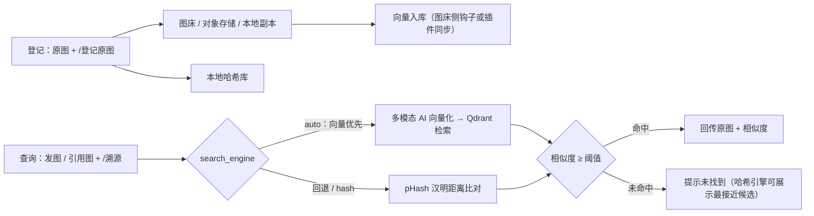

# astrbot_plugin_image_trace 图片溯源

[](./CHANGELOG.md)
[](./LICENSE)
[](https://github.com/AstrBotDevs/AstrBot)
[](https://www.python.org/)

群内发送 / 引用图片 + 触发指令 → 提取群内图片 → **双引擎**检索最相似的原图 → 相似度达标时把原图回传群聊：

- **哈希引擎**（v1.1.0 起）：本地计算 pHash/dHash/aHash，与本地图库比对汉明距离；
- **向量引擎**（v1.2.0 起）：调用多模态向量 AI 生成图片向量，在 Qdrant 向量库检索图床图片（图床侧每张上传经实时钩子自动入库，无需手动登记）。

QQ 消息的收发完全通过 AstrBot 的事件与消息组件 API 完成，不依赖任何平台私有接口；日常查询只依赖配置好的向量 AI / Qdrant（哈希引擎可全程本地）。



## 目录

- [功能特性](#功能特性)
- [指令](#指令)
- [安装](#安装)
- [快速上手](#快速上手)
- [向量引擎（Qdrant + 多模态向量 AI，v1.2.0）](#向量引擎qdrant--多模态向量-aiv120)
- [图床对接（generic_http 模式）](#图床对接generic_http-模式)
- [CloudFlare-ImgBed 对接（cloudflare_imgbed 模式）](#cloudflare-imgbed-对接cloudflare_imgbed-模式)
- [对象存储对接（Cloudflare R2 / 甲骨文 OCI）](#对象存储对接cloudflare-r2--甲骨文-oci)
- [本地目录建库说明](#本地目录建库说明)
- [配置项](#配置项)
- [工作原理](#工作原理)
- [项目结构与开发](#项目结构与开发)
- [常见问题](#常见问题)
- [数据存储](#数据存储)
- [环境要求](#环境要求)
- [参与贡献](#参与贡献)
- [许可证](#许可证)
- [致谢](#致谢)

## 功能特性

- **发图溯源**：与图片同条消息发送 `/溯源`，或引用一张图片发送 `/溯源`，插件按当前引擎检索最相似的原图，达标即自动回传原图与相似度信息。
- **向量引擎（可选，v1.2.0）**：配置 `vector_search` 后，用多模态向量 AI（OpenAI 兼容 `/v1/embeddings`，如 Qwen3-VL-Embedding 系）把查询图转成向量，到 Qdrant 向量库检索图床图片；图床侧每张上传由服务器钩子实时向量化入库。检索走 cosine 相似度，对压缩、缩放、裁剪、水印等改动比哈希更鲁棒，覆盖哈希难判定的构图近似变体。
- **感知哈希特征**：pHash（DCT 感知哈希，默认 256bit）+ dHash + aHash，对压缩、缩放、轻微水印、EXIF 旋转均有较强鲁棒性；GIF 取首帧。纯 Pillow + numpy 实现，无需 scipy/GPU。
- **可选 AI 复核**：开启 `ai_verify` 后，哈希命中的候选图会交给当前会话的视觉大模型二次确认"是否同一张图"，进一步降低误报；未配置视觉模型时自动跳过。
- **泛用图床与对象存储接口**：登记原图支持五种模式——
  - `local`：原图副本保存到机器人数据目录，零配置可用；
  - `generic_http`：通过可配置的通用 HTTP 接口上传到自建图床（Lsky Pro、EasyImages、Chevereto 等）；
  - `cloudflare_imgbed`：CloudFlare-ImgBed 自建图床（官方 REST API，`POST /upload` 上传，支持 `uploadChannel`/`uploadFolder` 等官方参数，`/溯源删除` 可同步删除远端文件）；
  - `cloudflare_r2`：Cloudflare R2 对象存储，走官方 S3 兼容 API（AWS Signature V4 签名）；
  - `oracle_oci`：甲骨文 OCI Object Storage，走官方 Amazon S3 兼容 API（Customer Secret Key 凭据）。
  - 后四种上传失败或无法生成长期有效的公开直链时，自动回退本地副本，登记流程不中断。
- **本地目录建库**：配置 `scan_dirs` 指向本地图库/图床存储目录，一键建立索引（支持增量重扫）。

## 指令

| 指令 | 别名 | 说明 | 权限 |
| --- | --- | --- | --- |
| `/溯源` | `/找原图` | 与图片同条消息发送，或引用图片发送，检索并回传原图 | 所有人 |
| `/登记原图 [备注]` | `/原图登记` | 将图片作为原图登记入库 | 默认仅管理员（可配置） |
| `/溯源状态` | - | 查看图库统计与配置摘要 | 所有人 |
| `/溯源重扫 [force]` | - | 扫描 `scan_dirs` 目录建立/更新索引；`force` 重建全部 | 管理员 |
| `/溯源删除 <编号>` | - | 按 ID 删除图库条目（同步清理插件侧写入的向量点、远端对象与本地副本） | 管理员 |
| `/溯源帮助` | - | 使用帮助 | 所有人 |

## 安装

**获取插件**（二选一）：

- **从仓库安装**：AstrBot WebUI →「插件管理」→ 从仓库安装，填入
  `https://github.com/diyushuang/astrbot_plugin_image_trace`；
- **手动安装**：下载本仓库，将 `astrbot_plugin_image_trace` 目录放入 AstrBot 的 `data/plugins/` 下。

**装好之后**：

1. 首次安装时 AstrBot 会自动读取 `requirements.txt` 安装依赖（Pillow、numpy、aiohttp）；如需手动执行：
   ```
   pip install -r requirements.txt
   ```
2. 在 WebUI「插件管理」中重载插件，或在插件卡片菜单选择"重载插件"；
3. 前往「快速上手」完成首次登记与检索。

## 快速上手

1. 管理员在群里发送一张原图 + `/登记原图 长草颜文字素材`（或引用原图发送）；
2. 之后群里有人发出该图的压缩/转发版本时，引用它发送 `/溯源`；
3. 机器人回传相似度与登记时的原图。

也可以批量建库：把所有原图放进一个目录（例如本地图床 Lsky Pro 的存储目录），在插件配置 `scan_dirs` 中填入该目录的绝对路径，然后执行 `/溯源重扫`。

## 向量引擎（Qdrant + 多模态向量 AI，v1.2.0）

典型部署：图床（如 CloudFlare-ImgBed）与 Qdrant 跑在服务器上——**图床每上传一张图，由图床侧钩子/入库服务实时调向量 AI 算向量并写入 Qdrant**（入库侧属服务器侧部署，不属本插件范畴）；本插件只负责查询侧：收到 `/溯源` 图后调同一个向量 AI 向量化，再 `points/search` 检索，相似度 ≥ 阈值即把 Qdrant payload 里的图床原图 URL 回传（payload 需含原图直链 `image_url` 字段）。

### 关键配置（`vector_search` 节）

| 配置 | 说明 |
| --- | --- |
| `qdrant_url` | Qdrant REST 地址，如 `http://<你的服务器IP>:6333`。**须公网可达**（插件出网带 SSRF 校验，不访问内网地址） |
| `qdrant_api_key` | Qdrant API Key（`QDRANT__SERVICE__API_KEY` 对应的值） |
| `collection_name` | 集合名，默认 `imgbed_images`，需与入库侧一致 |
| `embed_base_url` | 多模态向量 AI 的 base，如 `https://<你的网关域名>/v1`（实际请求 `POST {base}/embeddings`） |
| `embed_api_key` | 该向量 AI 的 API Key |
| `embed_model` | **接受图片输入**的 embedding 模型 ID（文本 embedding 模型无法对图片向量化），如 `Qwen/Qwen3-VL-Embedding-8B` |
| `embed_image_input` | 图片输入序列化：`qwen-vl`（content 数组）/ `nemotron-vl`（裸 dataURL + input_type，NVIDIA llama-nemotron-embed-vl 系）/ `dataurl`（裸 dataURL）/ `jina-image`（base64 对象），模型 400 时切换 |
| `embed_input_type` | 仅 nemotron-vl 模式相关：非对称模型的 input_type，图片只能走 passage 侧（插件固定使用 passage），需与图床入库侧核对一致 |
| `similarity_threshold` | cosine 相似度阈值，默认 `0.80`（同图变体通常 0.85+，建议用成对图片实测校准） |
| `top_k` | 每次取回候选数，默认 `5` |
| `request_timeout` | 请求超时（秒），默认 `30` |
| `vector_index_on_register` | `/登记原图` 后是否插件侧同步写向量库，默认开；`cloudflare_imgbed` 等图床自带服务器侧钩子时自动跳过，避免重复计算 |

### 一致性约束（重要）

- `embed_model` / `embed_base_url` / `embed_image_input`（nemotron-vl 模式还包括 `embed_input_type`）的值**必须与图床入库侧完全一致**，否则查询向量与库中向量不在同一向量空间，相似度无意义；
- 中途切换向量模型 = 需要把库中所有图片**全量重嵌入**一次（服务器侧执行强制回填），否则旧向量与新模型不兼容；
- 引擎切换：`search_engine = auto`（默认，向量优先、未命中/不可用自动回退哈希）、`vector`（只用向量）、`hash`（只用哈希，保持 v1.1.0 行为）。

### 快速验证

1. 配置完成后在群里发图 + `/溯源`：命中时回复相似度与图床原图 URL；
2. `/溯源状态` 会显示当前引擎、向量库点数与 Embed 模型，便于确认连通；
3. 若提示向量引擎未启用/出错，先检查 `vector_search` 配置项是否齐全、`/溯源状态` 中向量库计数是否为可用数字。

## 图床对接（generic_http 模式）

插件通过"通用 HTTP 上传接口"对接图床，只需 4 个关键配置：

| 配置 | 说明 | Lsky Pro 示例 |
| --- | --- | --- |
| `api_url` | 上传接口地址 | `https://bed.example.com/api/v1/upload` |
| `token` + `auth_header` + `auth_prefix` | 鉴权：发送 `auth_header: auth_prefix + token` 请求头 | `Authorization: Bearer 1|xxxxxx` |
| `file_field` | multipart 文件字段名 | `file` |
| `url_path` | 从响应 JSON 中按点号路径提取图片直链 | `data.url` |

常见图床参考值：

- **Lsky Pro（兰空图床）**：`api_url=https://域名/api/v1/upload`，`auth_header=Authorization`，`auth_prefix=Bearer `（保留尾部空格），`file_field=file`，`url_path=data.url`。Token 在图床个人中心 → API 中生成。
- **EasyImages（简单图床）**：`api_url=https://域名/index.php`（开启 API 上传），常见 `auth_header=token`，`auth_prefix` 留空，`file_field=file`，`url_path=url`。
- **Chevereto**：`api_url=https://域名/api/1/upload`（需带 `key` 参数，可放入 `extra_fields`），`file_field=source`，`url_path=image.url`。

注意：

- 图床地址必须是**公网可访问的 http/https 地址**，插件会拒绝指向内网/环回地址的请求（SSRF 防护）；
- 回传原图时若使用图床直链（`Image.fromURL`），该直链需要 QQ 服务器可访问（即公网可读）；若图床是私有读，请使用 `local` 模式；
- 上传失败会自动回退为本地副本保存，登记流程不会中断。

## CloudFlare-ImgBed 对接（cloudflare_imgbed 模式）

按 [CloudFlare-ImgBed 官方文档](https://github.com/MarSeventh/CloudFlare-ImgBed)（REST API 详见官方文档站 `/api/` 页面）实现：

| 配置 | 说明 |
| --- | --- |
| `cfi_base_url` | 你部署的站点首页地址（必填），如 `https://img.example.com` |
| `cfi_token` | API Token：站点后台「系统设置 → 安全设置 → API Token 管理」创建；上传需 `upload` 权限，`/溯源删除` 同步删远端文件需 `delete` 权限 |
| `cfi_auth_code` | 上传鉴权码（`authCode` 查询参数），站点启用登录校验时使用，与 Token 二选一或同时配置 |
| `cfi_upload_channel` | 存储渠道（`uploadChannel` 查询参数）：`telegram`、`cfr2`、`s3`、`discord`、`huggingface`、`webdav`，留空用站点默认 |
| `cfi_channel_name` | 具体渠道名（`channelName` 查询参数），多渠道场景使用 |
| `cfi_upload_folder` | 上传目录（`uploadFolder` 查询参数，相对路径，如 `img/test`） |

对接细节（严格按官方文档）：

- **上传**：`POST {站点}/upload`，multipart 表单文件字段名 `file`；鉴权用 `Authorization: Bearer <Token>` 请求头（官方推荐格式）或 `authCode` 查询参数；两者都未配置且站点未开启登录校验时直接匿名上传；
- **响应**：成功返回数组 `[{"src": "/file/xxx.jpg", "publicUrl": "..."}]`。插件落库直链 = `cfi_base_url + src`（不使用 `publicUrl`，保证链接与站点同源，`/溯源删除` 才能反解文件路径）；
- **删除同步**：`/溯源删除` 时按 `POST /api/manage/delete/batch`（body `{"fileIds": [... ]}`）best-effort 删除远端文件——仅当 Token 已配置且直链前缀与当前站点匹配时才发起，失败不影响本地条目删除；
- 上传失败自动回退本地副本。

## 对象存储对接（Cloudflare R2 / 甲骨文 OCI）

两种对象存储均按各家官方文档的 **Amazon S3 兼容 API** 实现（AWS Signature Version 4 签名，纯标准库实现，无新增依赖）：

### Cloudflare R2（`cloudflare_r2` 模式）

1. Cloudflare 控制台 → R2，创建存储桶，并记下概览页的**账户 ID**；
2. 「管理 R2 API 令牌」→ 创建 API 令牌（权限需含**对象读写**），获得 `r2_access_key_id` 与 `r2_secret_access_key`（仅显示一次）；
3. 在存储桶「设置 → 公开访问」中开启 **r2.dev 子域**或绑定**自定义域名**，作为 `r2_public_base_url`（如 `https://pub-xxxx.r2.dev`）。

| 配置 | 填写 |
| --- | --- |
| `r2_account_id` | Cloudflare 账户 ID |
| `r2_access_key_id` / `r2_secret_access_key` | R2 API 令牌凭据 |
| `r2_bucket` | 存储桶名称 |
| `r2_public_base_url` | r2.dev 子域或自定义域名（`https://` 开头，不带尾斜杠） |
| `r2_endpoint` | 可选；欧盟司法区桶填 `https://<账户ID>.eu.r2.cloudflarestorage.com` |

按官方文档：endpoint 为 `https://<账户ID>.r2.cloudflarestorage.com`（欧盟等司法区有对应子域），签名 region 固定为 `auto`，单次 PutObject 最大 5 GiB。

### 甲骨文 OCI Object Storage（`oracle_oci` 模式）

1. OCI 控制台确认存储桶所在**区域**（如 `ap-osaka-1`）与 **Object Storage 命名空间**（Namespace 字符串）；
2. 「用户设置 → Customer Secret Keys（客户密钥）」→ 生成密钥，获得 `oci_access_key_id`（Access Key）与 `oci_secret_access_key`（Secret Key，仅显示一次）；
3. 公开直链二选一：
   - 将存储桶可见性设为 **Public**（公共桶），开启 `oci_public_bucket`，直链使用官方对象 URL 格式 `https://objectstorage.<区域>.oraclecloud.com/n/<命名空间>/b/<桶>/o/<对象名>`；
   - 或在控制台为存储桶创建一条**带对象名前缀的预认证请求（PAR，AnyObjectRead）**，把其 URL（以 `/o/` 结尾）填入 `oci_public_base_url`，直链 = 该地址 + 对象名。

按官方文档：S3 兼容 endpoint 为 `https://<命名空间>.compat.objectstorage.<区域>.oraclecloud.com`（仅 path-style），签名 region 使用 OCI 区域标识。

> 两种对象存储的删除同步：`/溯源删除` 删除图库条目时会一并调用 DeleteObject 删除远端对象（仅删除与当前配置桶匹配的直链，失败不影响删除流程）。
> 直链需 QQ 服务器可访问（公网可读）才能回图；R2 未开启公开访问、OCI 桶为私有且未配置 PAR 时，插件自动回退本地副本并在登记回复中说明原因。

## 本地目录建库说明

- `scan_dirs` 必须是 **机器人进程可访问的绝对路径**；若 AstrBot 运行在 Docker 中，需将目录挂载进容器；
- 回传扫描目录中的原图使用本地文件路径发送（`Image.fromFileSystem`），要求**协议端（如 NapCat）与 AstrBot 在同一文件系统**；如果协议端独立部署，建议登记原图时走 `generic_http` 图床模式（回传走直链），或将目录共享挂载；
- `/溯源重扫` 为增量扫描（跳过已索引文件），`/溯源重扫 force` 重建全部扫描索引；文件被移出目录后，对应条目会在下次重扫时自动清理。

## 配置项

| 配置 | 默认 | 说明 |
| --- | --- | --- |
| `similarity_threshold` | `0.85` | 相似度阈值（0~1），相似度 = 1 - 汉明距离/总位数 |
| `hash_size` | `16` | pHash 精度：16→256bit（推荐），8→64bit；**取值必须为 4~32 之间 4 的倍数**；修改后需 `/溯源重扫 force` |
| `top_n` | `3` | 未命中时提示的最接近候选数，0 表示不提示 |
| `max_images_per_query` | `3` | 单次溯源最大处理图片数 |
| `max_download_mb` | `20` | 单张图片大小上限（MB） |
| `scan_dirs` | `[]` | 本地图库目录列表（绝对路径） |
| `search_engine` | `auto` | `auto`=向量优先（未命中/不可用回退哈希）/ `vector` / `hash` |
| `vector_search.*` | - | Qdrant 地址/Key/集合、向量 AI 地址/Key/模型/输入格式、向量阈值/top_k/超时/登记同步开关（详见上方章节） |
| `image_bed.mode` | `local` | `local` / `generic_http` / `cloudflare_imgbed` / `cloudflare_r2` / `oracle_oci` |
| `image_bed.api_url` 等 | - | generic_http 模式的上传接口、鉴权、字段名、响应直链 JSON 路径等 |
| `image_bed.cfi_*` | - | cloudflare_imgbed 模式：站点地址、API Token、鉴权码、存储渠道、渠道名、上传目录 |
| `image_bed.r2_*` | - | cloudflare_r2 模式：账户 ID、API 令牌凭据、存储桶、endpoint、公开访问域名 |
| `image_bed.oci_*` | - | oracle_oci 模式：命名空间、区域、Customer Secret Key 凭据、存储桶、公开桶开关/自定义公开地址 |
| `ai_verify` | `false` | 是否用视觉大模型复核命中结果 |
| `register_admin_only` | `true` | 仅管理员可登记原图 |

## 工作原理

1. **图片提取**：遍历 `event.message_obj.message` 消息链，直接取 `Image` 段；引用消息从 `Reply.chain`（被引用消息段）中提取图片，按链接去重。
2. **取图**：优先调用 AstrBot 内置的 `Image.convert_to_file_path()` 媒体解析（自动处理 URL 下载、base64、本地文件），失败时才走自带下载兜底（含 SSRF 校验）。
3. **特征计算**：灰度化 → EXIF 转正 → 缩放 → DCT（预计算正交矩阵）→ 低频中值二值化得到 pHash；辅以 dHash/aHash。计算在 `asyncio.to_thread` 中执行，不阻塞事件循环。
4. **相似度检索**：图库哈希常驻内存（numpy 位矩阵，整体替换 + 快照读），XOR + 查表 popcount 批量计算汉明距离，数万张图毫秒级检索；dHash/aHash 一并入库留存，预留给后续的二级确认，当前检索仅使用 pHash。
5. **结果回传**：优先用图床直链发图，其次本地文件；附带相似度、备注、尺寸与入库时间。

## 项目结构与开发

代码按职责拆分为 8 个模块，依赖方向单向（`main` → 各子模块；子模块 → `common` / `url_guard`）：

| 文件 | 职责 | 关键约束 |
| --- | --- | --- |
| `main.py` | 插件入口：指令、图片提取、引擎调度、AI 复核、生命周期 | auto 引擎的"向量优先、失败回退哈希"由本层编排 |
| `features.py` | pHash / dHash / aHash 感知特征计算（纯 Pillow + numpy） | pHash 十六进制长度统一由 `phash_hex_len()` 提供，任何处不得自行推导 |
| `library.py` | SQLite 图库 + 内存哈希位矩阵检索 | 写路径持锁，缓存整体替换 + 快照读；重操作需经 `asyncio.to_thread` 调用 |
| `image_bed.py` | 五种图床/对象存储模式的上传、直链反解、远端删除 | 上传失败一律回退本地副本，登记流程不中断 |
| `s3_store.py` | 纯标准库 AWS SigV4 签名 + 最小 S3 兼容客户端 | 签名与 URL/方法绑定，被重定向即报错而非复用签名 |
| `vector_search.py` | Qdrant 检索 + OpenAI 兼容 embeddings 客户端 | embed 三值须与图床入库侧一致；错误统一归为 `VectorEngineError` |
| `url_guard.py` | SSRF 防护：逐跳校验、IP 钉扎、响应限长 | 所有出网会话必须用 `make_pinned_connector()` 建连接器 |
| `common.py` | 配置解析工具与共享常量 | 真值表/常量只在此维护一份，各模块不得自备 |

两条核心数据流：

```
登记原图：
  图片段 → _resolve_local_file（AstrBot 媒体解析优先，失败走 SSRF 校验兜底下载）
        → compute_features（to_thread）→ add_if_absent 查重（锁内原子）
        → bed.store()（按图床模式上传，失败回退本地副本）→ 写库
        → 可选：同步向量点（内容指纹派生 point id，幂等）

/溯源：
  图片段 → _resolve_local_file
        → 向量引擎：embed_file → Qdrant points/search → 阈值过滤（命中全回传）
        或 哈希引擎：library.search（汉明距离）→ 阈值过滤 → 可选 AI 复核
        → 回传原图（直链优先，其次本地文件）
```

开发注意：

- 出网请求（图床、向量服务、对象存储、兜底下载）一律经 `url_guard.guarded_request`，
  连接器用 `make_pinned_connector()` 创建；不要新建裸 `aiohttp.ClientSession` 直连；
- 配置解析使用 `common.as_int` / `as_float` / `truthy` / `is_blank`，不要写
  `value or default`（会把合法的 0 / False 吞掉）；
- 涉及 SQLite 或大文件复制的调用若出现在 async 上下文，应包 `asyncio.to_thread`；
- 群聊回复文案保持脱敏：含内网地址 / Key 的错误细节只进日志，不进群聊；
- 发布包按白名单打包 14 个文件（8 个 `.py` + README / CHANGELOG / metadata /
  requirements / _conf_schema / LICENSE），不含 `.git`、`data/` 与会话状态目录。

## 常见问题

- **命中了但不是同一张图？** 提高 `similarity_threshold`，或开启 `ai_verify` 让视觉大模型复核。
- **明明登记过却没找到？** 检查图片是否被严重裁剪/拼贴（感知哈希对大幅构图变化不敏感），可适当降低阈值试试；另外确认 `hash_size` 与建库时一致（不一致请 `/溯源重扫 force`）。
- **回传的图发不出来？** 使用图床直链时确认直链公网可读；使用本地文件时确认协议端能访问该路径。
- **向量引擎显示未启用/报错？** 运行 `/溯源状态` 查看原因：`vector_search` 配置缺项会直接提示缺哪个字段；Qdrant 连接失败多为地址/Key 错误或端口未放行。
- **刚上传到图床的图检索不到？** 图床侧入库由钩子/入库服务完成，通常秒到分钟级；可稍等后重试，或在服务器侧查看入库服务日志与向量库计数。
- **向量阈值怎么定？** 用「同图变体对」与「不同图对」各几组实测相似度：取高于所有不同图、低于所有同图变体的分界（一般 0.80~0.90 之间）。
- **相似度的"AI"体现在哪？** 特征提取与比对使用计算机视觉中的感知哈希算法（DCT 频域特征），全程本地运行；如需大模型参与判断，开启 `ai_verify` 即可。

## 数据存储

- 图库索引：`data/plugin_data/astrbot_plugin_image_trace/library.db`（SQLite）
- 本地图床副本：`data/plugin_data/astrbot_plugin_image_trace/images/`
- 临时文件：`data/plugin_data/astrbot_plugin_image_trace/tmp/`（自动清理）

更新插件不会覆盖 `data` 目录下的数据。

## 环境要求

- AstrBot >= 4.0.0
- Python 3.10+
- 依赖：Pillow、numpy、aiohttp（见 `requirements.txt`）

## 参与贡献

欢迎通过 Issue 反馈问题，或提交 Pull Request 改进代码：

- Issue 请附 `/溯源状态` 输出与关键日志（注意先脱敏，不要贴 Key / 内网地址）；
- 开发约束见「项目结构与开发」：出网一律经 `url_guard`，配置解析用 `common`，
  群聊回复文案脱敏，SQLite / 大文件等重操作包 `asyncio.to_thread`；
- 提交前确认 `metadata.yaml` 与 `main.py` 顶部 `@register(...)` 的版本号一致。

## 许可证

本项目以 [AGPL-3.0](./LICENSE) 协议开源。

## 致谢

- [AstrBot](https://github.com/AstrBotDevs/AstrBot) — 易于扩展的多平台 LLM 聊天机器人框架；
- [Qdrant](https://github.com/qdrant/qdrant)、[CloudFlare-ImgBed](https://github.com/MarSeventh/CloudFlare-ImgBed)、Cloudflare R2、Oracle Cloud Infrastructure — 对接均按各自官方文档实现。
