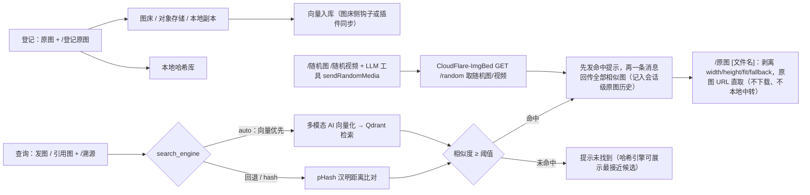

<div align="center">


# 图片溯源 · AstrBot Plugin

**群聊里随手转发的一张图，一键找回它的原图。**

[](./CHANGELOG.md)
[](https://github.com/AstrBotDevs/AstrBot)
[](https://www.python.org/)
[](./LICENSE)
[](https://github.com/diyushuang/astrbot_plugin_image_trace/stargazers)
[](https://github.com/diyushuang/astrbot_plugin_image_trace/issues)

<sub>感知哈希（pHash）+ Qdrant 多模态向量<b>双引擎</b> · OneBot 原生 URL 直传 · CloudFlare-ImgBed / R2 / OCI / 自建图床</sub>

_An AstrBot plugin that traces a reposted, compressed or cropped image back to its original, powered by perceptual hashing and Qdrant multimodal vector search._

[快速开始](#快速开始) · [指令](#指令) · [配置项](#配置项) · [存储对接](#存储对接) · [工作原理](#工作原理) · [常见问题](#常见问题) · [更新日志](./CHANGELOG.md)

</div>

---

> [!IMPORTANT]
> **AI 生成声明**：本项目代码由 AI 编程助手（ZCode，GLM 模型）辅助生成，经人工审查与多轮安全审计后发布；文档中的服务对接内容依据各服务官方文档整理。使用或二次分发前请自行审阅代码。

## 目录

| | | |
| --- | --- | --- |
| [特性一览](#特性一览) | [快速开始](#快速开始) | [安装](#安装) |
| [指令](#指令) | [配置项](#配置项) | [存储对接](#存储对接) |
| [向量引擎](#向量引擎qdrant--多模态向量-ai) | [本地目录建库](#本地目录建库) | [工作原理](#工作原理) |
| [项目结构与开发](#项目结构与开发) | [常见问题](#常见问题) | [数据与要求](#数据存储与环境要求) |

## 特性一览

| 能力 | 说明 |
| --- | --- |
| 🔍 **发图溯源** | 与图片同条消息（或引用图片）发送 `/溯源`，按当前引擎检索最相似的原图，相似度达标即回传 |
| 🧠 **向量引擎**（可选） | 多模态向量 AI（OpenAI 兼容 `/v1/embeddings`）+ Qdrant 检索，对压缩、缩放、裁剪、水印比哈希更鲁棒 |
| 🧮 **哈希引擎**（可离线） | pHash / dHash / aHash，纯 Pillow + numpy 实现，无需 GPU，数万张图毫秒级比对 |
| ⚡ **URL 直传** | QQ `aiocqhttp` 经 OneBot 原生接口直传图床 URL（避免适配器转 base64），失败自动回退本地压缩 |
| 🧩 **一次一条** | 向量命中的多张相似图合并为**一条**消息，图文交替排列，每张图的配文紧贴它自己 |
| 🗂️ **多种存储** | 图床副本 / 通用 HTTP 图床（Lsky Pro、EasyImages、Chevereto…）/ CloudFlare-ImgBed / Cloudflare R2 / 甲骨文 OCI |
| 🎲 **随机图** | `/随机图`、`/随机视频` 从图床随机接口取图回传，并可被 LLM 工具 `sendRandomMedia` 调用 |
| 🖼️ **`/原图` 直取** | 从会话历史找回原图，或按文件名直接到图床取；均为原图 URL 直传，不下载、不本地中转 |
| 🛡️ **安全加固** | 全部出网经 SSRF 防护（逐跳校验 + IP 钉扎 + 响应限长）；密钥字段在配置面板标记为 secret |

> [!NOTE]
> `/溯源` 日常查询只依赖配置好的向量 AI 与 Qdrant；哈希引擎可全程本地运行，不依赖任何外部服务。

## 快速开始

1. **登记原图** — 管理员在群里发送一张原图 + `/登记原图 长草颜文字素材`（或引用原图发送）；
2. **触发溯源** — 之后有人发出该图的压缩/转发版本时，引用它发送 `/溯源`；
3. **拿到原图** — 机器人回传相似度与登记时的原图，可直接发送 `/原图` 再取一次。

批量建库：把所有原图放进一个目录（例如本地图床的存储目录），在配置 `scan_dirs` 填入该目录**绝对路径**，然后执行 `/溯源重扫`。



## 安装

**方式一 · 从仓库安装（推荐）**：WebUI →「插件管理」→ 从仓库安装，填入 `https://github.com/diyushuang/astrbot_plugin_image_trace`。

**方式二 · 手动安装**：下载本仓库，将 `astrbot_plugin_image_trace` 目录放入 AstrBot 的 `data/plugins/` 下。

装好后：

1. AstrBot 会自动读取 `requirements.txt` 安装依赖（Pillow、numpy、aiohttp、pillow-heif）；需手动安装时执行：
   ```bash
   pip install -r requirements.txt
   ```
2. 在 WebUI「插件管理」中重载插件；
3. 按上方[快速开始](#快速开始)完成首次登记与检索。

> [!NOTE]
> 本插件**尚未上架 AstrBot 插件市场**，请使用上面两种方式安装。

> [!TIP]
> 只想离线用本地图库？把 `search_engine` 设为 `hash`、把原图目录填进 `scan_dirs`，然后 `/溯源重扫` 即可，**无需任何外部服务**。

## 指令

| 指令 | 别名 | 说明 | 权限 |
| --- | --- | --- | --- |
| `/溯源` | `/找原图` | 与图片同条消息发送，或引用图片发送，检索并回传原图 | 所有人 |
| `/登记原图 [备注]` | `/原图登记` | 将图片作为原图登记入库 | 默认仅管理员（可配置） |
| `/原图 [文件名]` | - | 取原图：带文件名时**直接到图床按名取**（无需先回传）；不带文件名取本会话最近回传的原图 | 所有人 |
| `/随机图 [目录]` | `/随机图片` | 从图床随机图接口取一张随机图片并回传 | 所有人 |
| `/随机视频 [目录]` | - | 从图床随机图接口取一段随机视频并回传 | 所有人 |
| `/溯源状态` | - | 查看图库统计与配置摘要 | 所有人 |
| `/溯源重扫 [force]` | - | 扫描 `scan_dirs` 目录建立/更新索引；`force` 重建全部 | 管理员 |
| `/溯源删除 <编号>` | - | 按 ID 删除图库条目（同步清理插件侧写入的向量点、远端对象与本地副本） | 管理员 |
| `/溯源帮助` | - | 使用帮助 | 所有人 |

> [!WARNING]
> **`/原图` 与 `/登记原图` 是两个不同的命令**：前者是**找回**原图，后者是把图片**登记入库**（默认仅管理员）。名字相近，注意区分。

<details>
<summary><b>`/原图` 的查找顺序与直链口径（点击展开）</b></summary>

1. 先查**本会话回传历史**（`/溯源`、`/随机图` 回传过的图片都会记入）；
2. 历史未命中时，按文件名拼接 `{图床地址}/file/{文件名}` 并探测存在性后直传。图床地址取 `image_bed.cfi_base_url`（`cloudflare_imgbed` 模式）或 `random_media.base_url`；两者都未配置时会提示补配置；
3. 文件名允许带上传目录，例如 `/原图 2026/09/abc.jpg`。

直链口径：只按 CloudFlare-ImgBed 的 Read API 剥离 `width` / `height` / `fit` / `fallback`，其他图床的查询串原样保留（改动可能破坏签名或鉴权）。当前 `/原图` 只有「会话回传历史」与「图床直链」两条来源，不查 Qdrant 向量库与本地图库。

</details>

## 配置项

> [!NOTE]
> 面板标签里的【必填】= 启用对应功能后必须填写；【R2 必填】【OCI 必填】【generic_http 必填】【imgbed 必填】= 仅在所选模式下必填；【按需必填】= 取决于使用方式；【选填】= 可留空保持默认。
>
> **按需显隐**：储存桶组选择 `cloudflare_r2` / `oracle_oci` 后才展开对应字段，图床组选择 `generic_http` / `cloudflare_imgbed` 后才展开；进阶调优项收纳在顶层「显示进阶设置」与 `vector_search` 组内「显示进阶配置」两个开关后（默认关）。被隐藏字段的已填值保留，切换模式不丢失；旧版 WebUI 忽略显隐规则时所有字段照常显示。

### 基础配置

| 配置 | 默认 | 说明 |
| --- | --- | --- |
| `search_engine` | `auto` | `auto`=向量优先（未命中/不可用回退哈希）/ `vector` / `hash` |
| `scan_dirs` | `[]` | 本地图库目录列表（绝对路径）；仅用 `/登记原图` 建库可留空 |
| `image_bed.mode` | `local` | 图床模式：`local` / `generic_http` / `cloudflare_imgbed`；选定后组内展开对应字段 |
| `image_delivery.mode` | `scaled-url` | 回图模式：[详见下文](#回图模式) |
| `image_delivery.max_side` | `1920` | 缩放或本地压缩的最长边，范围 1~4096 |
| `image_delivery.quality` | `85` | 本地 JPEG 压缩质量，范围 1~100 |
| `image_delivery.verify_scaled` | `true` | 是否实测校验图床缩放真的生效（关闭后配文不再宣称「已压缩」） |
| `similarity_threshold` | `0.85` | 相似度阈值（0~1，哈希引擎），相似度 = 1 − 汉明距离 ÷ 总位数 |
| `ai_verify` | `false` | 是否用视觉大模型复核命中结果 |
| `register_admin_only` | `true` | 仅管理员可登记原图 |
| `random_media.base_url` | - | 【必填】随机图图床站点地址（公网可达 http/https） |
| `random_media.*` | - | 随机图接口路径 / Token / 默认目录 / 超时 / 重试 / 附带文件名 / LLM 开关 |
| `vector_search.*` | - | Qdrant 与向量 AI 配置，见[向量引擎](#向量引擎qdrant--多模态向量-ai) |
| `storage_bucket.*` | - | 储存桶（R2 / OCI）配置，见[存储对接](#存储对接) |

### 进阶配置（收纳在「显示进阶设置」后）

| 配置 | 默认 | 说明 |
| --- | --- | --- |
| `hash_size` | `16` | pHash 精度：16→256bit（推荐）；可选 4/8/12/16/20/24/28/32（须为 4 的倍数）。**修改后需 `/溯源重扫 force`** |
| `top_n` | `3` | 未命中时提示的最接近候选数，`0` 表示不提示 |
| `max_images_per_query` | `3` | 单次溯源最大处理图片数 |
| `max_download_mb` | `20` | 单张图片大小上限（MB） |
| `image_delivery.target_kb` | `0` | 本地压缩的目标体积上限（KB，0=不限制）。非 0 时启用质量阶梯 |
| `image_delivery.webp` | `false` | 本地压缩改用 WebP 输出（体积更小，编码更慢；噪声极多的图可能反而更大，此时自动回退原字节） |
| `random_media.api_endpoint` | `/random` | 随机图接口相对路径（不能填完整 URL） |
| `random_media.api_token` | - | 随机图接口 Token（`Authorization: Bearer`）；配置 Token 时图床地址必须为 `https` |
| `random_media.default_dir` | - | 未指定目录时使用的默认目录（如 `风景/2026`），留空从根目录取图 |
| `random_media.timeout` / `retry_count` | `10` / `3` | 单次请求超时（秒）/ 失败重试次数（指数退避，403 不重试） |
| `random_media.show_file_info` / `enable_llm` | `true` / `true` | 回传时是否附带文件名 / 是否允许 LLM 工具调用 |
| `advanced_settings` | `false` | 面板收纳开关 |
| `vector_search.advanced` | `false` | 面板收纳开关：开启后才显示向量引擎的进阶项 |

<a id="回图模式"></a>

<details>
<summary><b>回图模式（<code>image_delivery.mode</code>）与压缩策略详解（点击展开）</b></summary>

| 模式 | 行为 | 适用场景 |
| --- | --- | --- |
| `scaled-url`（默认） | CloudFlare-ImgBed 标准 `/file/` 直链追加官方 `width` / `height` / `fallback=original` 等比缩放参数后直传；图片不超过 `max_side` 时不追加参数 | 想省流量、又希望出问题时能回退到原图 |
| `original-url` | 直接直传原图 URL，不做任何处理 | 图床带宽充裕，追求最短链路 |
| `local-compress` | 插件下载后本地压缩再发（EXIF 转正、等比缩放、透明铺白底、JPEG 重编码、动图保持原样） | 图床直链协议端取不到，或必须转成 JPEG 才能被解析 |

**压缩标识只按证据写**：只有实测（图床缩放版字节更小）或本地压缩确实缩了字节，配文才写「已压缩」。图片不超过 `max_side` 时直接发原图 URL、不追加缩放参数——图床在图片不大或图像处理不可用时会按 `fallback=original` 原样返回，凭「URL 被改写」推断压缩会出现「文字说已压缩、收到的却是原图」。

**回传链路的效率设计**：

- **单次发送保证**：OneBot 直发结果分「已送达 / 明确失败 / 结果未知」三态，只有明确失败才允许换通道回退；超时属「结果未知」（消息很可能已送达），一律不重发，并按事件打去重标记，杜绝同一张图发两遍。
- **探测开销最小化**：所有探测并发执行（上限 4）且受 8 秒总预算约束，超预算按「说不准」处理；探测用独立的 5 秒超时；命中条目自带原图体积（向量 `payload.size_bytes` / 图库 `file_size`）时只探缩放版一次；图床明确拒绝缩放请求（405 / 501 / 400）后 600 秒内不再探测。
- **回传计划只算一次**：URL 计划（含探测）在直发前算好，失败回退路径直接复用。
- **本地压缩**：单次解码（不重复解码校验）、多图并发压缩（上限 3）、回退下载优先走内存（超过 8 MB 才落盘）。
- **提示与图片并行**：OneBot 场景下命中提示与图片消息同时下发，首图不必等提示的整轮往返。

</details>

## 存储对接

登记原图的存储位置由两组配置决定，**二选一即可**；储存桶配置完整时优先。

### 存储模式总览

| 模式 | 说明 | 公开直链 |
| --- | --- | --- |
| `image_bed.mode = local`（默认） | 原图副本保存到机器人数据目录，零配置 | 用本地文件路径发送，要求协议端与 AstrBot 同一文件系统 |
| `image_bed.mode = generic_http` | 通用 HTTP 接口上传到自建图床（Lsky Pro、EasyImages、Chevereto 等） | 图床提供 |
| `image_bed.mode = cloudflare_imgbed` | CloudFlare-ImgBed 官方 REST API，`/溯源删除` 可同步删远端 | 图床提供 |
| `storage_bucket.mode = cloudflare_r2` | Cloudflare R2（S3 兼容 API） | 需开启公开访问（`r2.dev` 或自定义域名） |
| `storage_bucket.mode = oracle_oci` | 甲骨文 OCI Object Storage（S3 兼容 API） | 公共桶，或配置预认证请求（PAR） |

> [!TIP]
> 远程存储上传失败、或无法生成长期有效的公开直链时，插件会**自动回退为本地副本**，登记流程不会中断。

<details>
<summary><b>通用 HTTP 图床（<code>generic_http</code>）：4 个关键配置 + 常见图床参考值</b></summary>

| 配置 | 说明 | Lsky Pro 示例 |
| --- | --- | --- |
| `api_url` | 上传接口地址 | `https://bed.example.com/api/v1/upload` |
| `token` + `auth_header` + `auth_prefix` | 鉴权：发送 `auth_header: auth_prefix + token` | `Authorization: Bearer 1\|xxxxxx` |
| `file_field` | multipart 文件字段名 | `file` |
| `url_path` | 从响应 JSON 按点号路径提取直链 | `data.url` |

常见图床参考值：

- **Lsky Pro（兰空图床）**：`api_url=https://域名/api/v1/upload`，`auth_header=Authorization`，`auth_prefix=Bearer `（保留尾部空格），`file_field=file`，`url_path=data.url`。Token 在图床个人中心 → API 中生成。
- **EasyImages（简单图床）**：`api_url=https://域名/index.php`（需开启 API 上传），常见 `auth_header=token`，`auth_prefix` 留空，`file_field=file`，`url_path=url`。
- **Chevereto**：`api_url=https://域名/api/1/upload`（需带 `key` 参数，可放入 `extra_fields`），`file_field=source`，`url_path=image.url`。

注意：图床地址必须是**公网可访问**的 http/https（插件拒绝指向内网/环回地址的请求）；回传用直链需协议端 / QQ 服务器可访问，私有读图床请改用 `local` 模式。

</details>

<details>
<summary><b>CloudFlare-ImgBed（<code>cloudflare_imgbed</code>）：配置项与对接细节</b></summary>

按 [CloudFlare-ImgBed 官方文档](https://github.com/MarSeventh/CloudFlare-ImgBed)实现：

| 配置 | 说明 |
| --- | --- |
| `cfi_base_url` | 【必填】站点首页地址，如 `https://img.example.com` |
| `cfi_token` | API Token：后台「系统设置 → 安全设置 → API Token 管理」创建；上传需 `upload` 权限，`/溯源删除` 同步删远端需 `delete` 权限 |
| `cfi_auth_code` | 上传鉴权码（`authCode` 查询参数），站点启用登录校验时使用，与 Token 二选一或同时配置 |
| `cfi_upload_channel` | 存储渠道（`uploadChannel`）：`telegram`、`cfr2`、`s3`、`discord`、`huggingface`、`webdav`，留空用站点默认 |
| `cfi_channel_name` | 具体渠道名（`channelName`），多渠道场景使用 |
| `cfi_upload_folder` | 上传目录（`uploadFolder`，相对路径，如 `img/test`） |

对接细节：

- **上传**：`POST {站点}/upload`，multipart 字段名 `file`；鉴权用 `Authorization: Bearer <Token>` 或 `authCode` 查询参数；都未配置且站点未开启登录校验时直接匿名上传。
- **响应**：成功返回 `[{"src": "/file/xxx.jpg", "publicUrl": "..."}]`。插件落库直链 = `cfi_base_url + src`（不使用 `publicUrl`，保证与站点同源，`/溯源删除` 才能反解文件路径）。
- **删除同步**：`/溯源删除` 按 `POST /api/manage/delete/batch`（body `{"fileIds": [...]}`）best-effort 删除远端文件——仅当 Token 已配置且直链前缀与当前站点匹配时才发起，失败不影响本地条目删除。

> [!NOTE]
> **Read API 已知约束**（影响 `/原图` 与缩放直传）：带缩放参数的请求**只接受 GET**（其他方法 405）；`Range` 不能与缩放参数同时使用（400）；图片处理默认关闭，需在后台「系统设置 → 安全设置 → 访问管理」开启，未开启时带参数的请求返回 403；`fallback=original` 会在格式不支持/超限/处理失败时回退原图。

</details>

<details>
<summary><b>储存桶：Cloudflare R2 与甲骨文 OCI 的配置步骤</b></summary>

两种对象存储按各家官方文档的 **Amazon S3 兼容 API** 实现（AWS Signature Version 4 签名，纯标准库，无新增依赖）。储存桶配置完整时**优先于图床设置**（R2 需 `r2_public_base_url`，OCI 需公共桶或 `oci_public_base_url`）；配置不完整时自动改用图床设置。

**Cloudflare R2（`storage_bucket.mode = cloudflare_r2`）**

1. Cloudflare 控制台 → R2，创建存储桶，记下概览页的**账户 ID**；
2. 「管理 R2 API 令牌」→ 创建令牌（权限需含**对象读写**），获得 `r2_access_key_id` 与 `r2_secret_access_key`（仅显示一次）；
3. 存储桶「设置 → 公开访问」中开启 **r2.dev 子域**或绑定**自定义域名**，作为 `r2_public_base_url`。

| 配置 | 填写 |
| --- | --- |
| `r2_account_id` | Cloudflare 账户 ID |
| `r2_access_key_id` / `r2_secret_access_key` | R2 API 令牌凭据 |
| `r2_bucket` | 存储桶名称 |
| `r2_public_base_url` | r2.dev 子域或自定义域名（`https://` 开头，不带尾斜杠） |
| `r2_endpoint` | 可选；欧盟司法区桶填 `https://<账户ID>.eu.r2.cloudflarestorage.com` |

按官方文档：endpoint 为 `https://<账户ID>.r2.cloudflarestorage.com`，签名 region 固定 `auto`，单次 PutObject 最大 5 GiB。

**甲骨文 OCI（`storage_bucket.mode = oracle_oci`）**

1. OCI 控制台确认存储桶**区域**（如 `ap-osaka-1`）与 **Object Storage 命名空间**；
2. 「用户设置 → Customer Secret Keys」→ 生成密钥，获得 `oci_access_key_id` 与 `oci_secret_access_key`（仅显示一次）；
3. 公开直链二选一：把桶设为 **Public**（开启 `oci_public_bucket`），或在控制台创建**带对象名前缀的预认证请求（PAR，AnyObjectRead）**并把其 URL（以 `/o/` 结尾）填入 `oci_public_base_url`。

按官方文档：S3 兼容 endpoint 为 `https://<命名空间>.compat.objectstorage.<区域>.oraclecloud.com`（仅 path-style），签名 region 使用 OCI 区域标识。

`/溯源删除` 会一并调用 DeleteObject 删除远端对象（仅删除与当前配置桶匹配的直链）。直链需 QQ 服务器可访问才能回图；R2 未开公开访问、OCI 桶为私有且未配置 PAR 时，插件自动回退本地副本并在登记回复中说明原因。

</details>

> **从 v1.2.x 升级**：原先填在 `image_bed.mode = cloudflare_r2 / oracle_oci` 及对应 `r2_*` / `oci_*` 字段的老配置，会在插件启动时**自动迁移**到 `storage_bucket` 组（日志有迁移记录），无需手动操作。

## 向量引擎（Qdrant + 多模态向量 AI）

典型部署：图床（如 CloudFlare-ImgBed）与 Qdrant 跑在服务器上——**图床每上传一张图，由图床侧钩子/入库服务实时调向量 AI 算向量并写入 Qdrant**（入库侧属服务器侧部署，不属本插件范畴）。本插件只负责**查询侧**：收到 `/溯源` 图后调同一个向量 AI 向量化，再检索 Qdrant，相似度达标即把 payload 里的原图 URL 回传（payload 需含 `image_url` 字段）。

> [!IMPORTANT]
> **为什么插件也要填向量 AI？** Qdrant 里只存「向量数字」，不存图片。`/溯源` 时插件收到的是一张查询图，必须先用与入库侧**相同**的多模态向量 AI 把它转成向量才能比对——`embed_base_url` / `embed_model` 必填（网关无鉴权时 `embed_api_key` 可留空），且必须与入库侧一致，否则两边向量不在同一空间、相似度无意义。

<details>
<summary><b>关键配置（<code>vector_search</code> 组）</b></summary>

| 配置 | 说明 |
| --- | --- |
| `qdrant_url` | Qdrant REST 地址，如 `http://<你的服务器IP>:6333`。**须公网可达**（插件出网带 SSRF 校验，不访问内网地址） |
| `qdrant_api_key` | Qdrant API Key（`QDRANT__SERVICE__API_KEY` 对应的值） |
| `collection_name` | 集合名，默认 `imgbed_images`，需与入库侧一致 |
| `embed_base_url` | 多模态向量 AI 的 base，如 `https://<网关域名>/v1`（实际请求 `POST {base}/embeddings`） |
| `embed_api_key` | 该向量 AI 的 API Key；网关未开启鉴权时**可留空**（留空则不带鉴权头） |
| `embed_model` | **接受图片输入**的 embedding 模型 ID（文本 embedding 模型无法对图片向量化），如 `Qwen/Qwen3-VL-Embedding-8B` |
| `embed_image_input` | 图片输入序列化，**默认 `nemotron-vl`**（裸 dataURL + input_type，NVIDIA llama-nemotron-embed-vl 系只接受这一种）；备选 `qwen-vl`（content 数组，Qwen3-VL-Embedding 系）/ `dataurl` / `jina-image`。报 500 `'dict' object has no attribute 'strip'`（格式发给了只收字符串的模型）或 400 时切换 |
| `embed_input_type` | 仅 nemotron-vl 相关：非对称模型的 input_type，图片只能走 passage 侧（插件固定 passage），需与入库侧一致 |
| `similarity_threshold` | cosine 相似度阈值，默认 `0.80`（建议用成对图片实测校准） |
| `duplicate_vector_threshold` | 重复图合并阈值，默认 `0.995`；达到该值视为同一张图，只回传代表图 |
| `top_k` | 每次取回候选数，默认 `5` |
| `request_timeout` | 请求超时（秒），默认 `30` |
| `vector_index_on_register` | `/登记原图` 后是否插件侧同步写向量库，默认开；图床自带服务器侧钩子时自动跳过，避免重复计算 |

**一致性约束**：`embed_model` / `embed_base_url` / `embed_image_input`（nemotron-vl 模式还包括 `embed_input_type`）**必须与入库侧完全一致**；中途切换向量模型需把库中所有图片**全量重嵌入**一次，否则旧向量与新模型不兼容。

**Qdrant 兼容矩阵**：

| Qdrant 版本 | 检索接口 | 说明 |
| --- | --- | --- |
| 1.0 ~ 1.9 | `POST /points/search` | Query API 返回 404 时自动回退 |
| 1.10 ~ 1.18 | `POST /points/query` | 优先使用官方 Query API |
| 1.19+ | `POST /points/query` | `points/search` 已移除，必须使用 Query API |

集合需使用默认未命名向量；若使用命名向量或多向量，需在入库侧与查询侧统一调整请求结构。

**快速验证**：配置完成后在群里发图 + `/溯源`，命中时回复相似度与图床原图 URL；`/溯源状态` 会显示当前引擎、向量库点数与 Embed 模型；若提示向量引擎未启用/出错，先检查 `vector_search` 配置是否齐全。

</details>

## 本地目录建库

- `scan_dirs` 必须是**机器人进程可访问的绝对路径**；AstrBot 运行在 Docker 中时需把目录挂载进容器。
- 回传扫描目录中的原图使用本地文件路径发送（`Image.fromFileSystem`），要求**协议端（如 NapCat）与 AstrBot 在同一文件系统**；协议端独立部署时，建议登记原图走 `generic_http` 图床模式（回传走直链），或共享挂载目录。
- `/溯源重扫` 为增量扫描（跳过已索引文件），`/溯源重扫 force` 重建全部扫描索引；文件被移出目录后，对应条目会在下次重扫时自动清理。

## 工作原理

1. **图片提取** — 遍历 `event.message_obj.message` 消息链取 `Image` 段；引用消息从 `Reply.chain` 提取。去重按 `url` / `file` / `path` 三个标识求交（同一张图在不同位置往往只带其中一部分字段，只取其一会让同一张图被溯源两次）。
2. **取图** — 优先用 AstrBot 内置的 `Image.convert_to_file_path()` 媒体解析（自动处理 URL 下载、base64、本地文件），产物先经完整解码校验。认不出任何图片容器（图床错误体、rkey 过期、防盗链）才走自带下载兜底（含 SSRF 校验）；已认得出容器却解不开（缺解码器的 HEIC / 截断文件）直接带原因返回，不再重下。
3. **特征计算** — 灰度化 → EXIF 转正 → 缩放 → DCT（预计算正交矩阵）→ 低频中值二值化得到 pHash，辅以 dHash/aHash；全程在 `asyncio.to_thread` 中执行，不阻塞事件循环。
4. **相似度检索** — 图库哈希常驻内存（numpy 位矩阵，整体替换 + 快照读），XOR + 查表 popcount 批量算汉明距离，数万张图毫秒级；向量引擎走 Qdrant 检索并做同图去重。
5. **结果回传** — 统一入口收口哈希、向量、随机图三条链路：QQ `aiocqhttp` 优先经 OneBot 原生接口直传 URL，失败后回退本地压缩，最后回退标准消息链（细节见[回图模式](#回图模式)）。
6. **`/原图` 直取** — `/溯源` 与 `/随机图` 回传的图片都记入会话级原图历史；`/原图` 据此把原图直链直接下发，不下载不本地中转；历史未命中时按文件名拼图床直链、探测存在后直传。

<details>
<summary><b>技术细节：为什么哈希引擎也"AI"？pHash 是怎么算的？</b></summary>

- **相似度的"AI"体现在哪**：特征提取与比对属于计算机视觉中的**感知哈希**算法（DCT 频域特征 + 汉明距离），全程本地运行，不调用大模型；需要大模型参与判断时开启 `ai_verify`，由视觉模型二次确认「是否同一张图」。
- **pHash 流程**：转灰度 → 统一缩放到 `hash_size × 4` 见方 → 二维 DCT → 取左上 `hash_size × hash_size` 低频块 → 与中值比较二值化 → 打包成十六进制字符串。默认 `hash_size=16` 即 256 bit。
- **为什么换 `hash_size` 要重扫**：pHash 的十六进制长度由 `hash_size` 决定，长度与库中记录不一致的行会被判为不匹配、索引等于被清空，因此必须 `/溯源重扫 force`。

</details>

## 项目结构与开发

<details>
<summary><b>模块职责与关键约束（12 个模块，点击展开）</b></summary>

依赖方向单向：`main` → 各子模块；子模块 → `common` / `http_client` / `url_guard`。

| 文件 | 职责 | 关键约束 |
| --- | --- | --- |
| `main.py` | 插件入口：指令、图片提取、引擎调度、AI 复核、生命周期 | auto 引擎的「向量优先、失败回退哈希」由本层编排 |
| `http_client.py` | 共享受管 HTTP 客户端 | 统一持有启用 IP pinning 的 `aiohttp` 会话 |
| `features.py` | pHash / dHash / aHash 感知特征计算（Pillow + numpy + pillow-heif） | pHash 十六进制长度统一由 `phash_hex_len()` 提供，任何处不得自行推导；HEIF/HEIC 解码器在此防御式注册；支持格式表只维护一份，`image_file_ok(path)` 与 `image_bytes_ok(data)` 判据必须一致 |
| `library.py` | SQLite 图库 + 内存哈希位矩阵检索 | 写路径持锁，缓存整体替换 + 快照读；重操作需经 `asyncio.to_thread` |
| `image_bed.py` | 图床与储存桶各模式的上传、直链反解、远端删除 | 上传失败一律回退本地副本，登记流程不中断 |
| `image_delivery.py` | URL 缩放/原图还原、本地压缩、压缩证据三态、直发结果分类、图床直链拼装、向量命中去重的纯函数 | 不直接访问网络或 AstrBot 事件，便于独立测试 |
| `random_media.py` | ImgBed 随机图接口客户端与响应解析纯函数 | 出网经共享 HTTP 客户端；403 特判不重试；只取直链、不落地字节 |
| `media_history.py` | 会话级原图历史（LRU + 别名键） | 按会话/会话数封顶；主键与展示名双索引 |
| `s3_store.py` | 纯标准库 AWS SigV4 签名 + 最小 S3 兼容客户端 | 签名与 URL/方法绑定，被重定向即报错而非复用签名 |
| `vector_search.py` | Qdrant 检索 + OpenAI 兼容 embeddings 客户端 | embed 三值须与图床入库侧一致；错误统一归为 `VectorEngineError` |
| `url_guard.py` | SSRF 防护：逐跳校验、IP 钉扎、响应限长 | 所有出网经共享 HTTP 客户端调用，不绕过防护 |
| `common.py` | 配置解析工具与共享常量 | 真值表/常量只在此维护一份，各模块不得自备 |

**两条核心数据流**

```
登记原图：
  图片段 → _resolve_local_file（AstrBot 媒体解析优先，失败走 SSRF 校验兜底下载）
        → compute_features（to_thread）→ add_if_absent 查重（锁内原子）
        → bed.store()（按生效的储存桶/图床模式上传，失败回退本地副本）→ 写库
        → 可选：同步向量点（内容指纹派生 point id，幂等）

/溯源：
  图片段 → _resolve_local_file
        → 向量引擎：embed_file → Qdrant points/query（旧版回退 points/search）→ 阈值过滤与同图去重
        或 哈希引擎：library.search（汉明距离）→ 阈值过滤 → 可选 AI 复核
        → 统一回传入口（OneBot URL 直传优先，失败本地压缩，最后标准消息链）
```

**开发约束**

- 出网请求（图床、向量服务、对象存储、兜底下载）一律经 `url_guard.guarded_request`，连接器用 `make_pinned_connector()` 创建；不要新建裸 `aiohttp.ClientSession` 直连；
- 配置解析使用 `common.as_int` / `as_float` / `truthy` / `is_blank`，不要写 `value or default`（会把合法的 0 / False 吞掉）；
- 涉及 SQLite 或大文件复制的调用若出现在 async 上下文，应包 `asyncio.to_thread`；
- 群聊回复文案保持脱敏：含内网地址 / Key 的错误细节只进日志，不进群聊；
- 发布包按白名单打包 **19 个文件**（12 个 `.py` + `README.md` / `CHANGELOG.md` / `metadata.yaml` / `requirements.txt` / `_conf_schema.json` / `LICENSE` / `logo.png`），不含 `.git`、`data/` 与会话状态目录；
- 提交前确认 `metadata.yaml` 的 `version` 使用无 `v` 前缀的 SemVer，并与 `CHANGELOG.md`、README 徽章一致。

</details>

## 常见问题

<details>
<summary><b>命中了但不是同一张图 / 明明登记过却找不到？</b></summary>

- **误报**：提高 `similarity_threshold`，或开启 `ai_verify` 让视觉大模型复核。
- **漏报**：图片若被严重裁剪、拼贴，感知哈希对大幅构图变化不敏感，可适当降低阈值试试；另外确认 `hash_size` 与建库时一致（不一致请 `/溯源重扫 force`）。

</details>

<details>
<summary><b>回传的图发不出来？</b></summary>

- 用图床直链时，确认直链**公网可读**且协议端 / QQ 服务器能访问；
- 用本地文件时，确认协议端能访问该路径（容器部署常见坑：宿主机路径在协议端容器内不可见）；
- 图床开启了防盗链时，协议端取图可能被拦，改用 `local-compress` 模式可绕开。

</details>

<details>
<summary><b>向量引擎显示未启用 / 报错？</b></summary>

- 先跑 `/溯源状态`：`vector_search` 配置缺项会直接提示缺哪个字段；
- Qdrant 连接失败多为地址/Key 错误或端口未放行——注意插件出网带 SSRF 校验，**不访问内网地址**，Qdrant 需公网可达；
- 报 500 `'dict' object has no attribute 'strip'` 说明 `embed_image_input` 与模型不匹配（格式发给了只收字符串的模型），按模型切换该配置。

</details>

<details>
<summary><b>同时配置了储存桶和图床，登记原图存哪？升级后老配置去哪了？</b></summary>

- 储存桶配置完整时优先用储存桶（直链长期有效，更适合溯源回图）；储存桶没配、`mode=none` 或配置不完整时用图床。`/溯源状态` 的「存储方式」一行会显示当前生效来源。
- 升级到 v1.3.0 后，原先填在图床设置里的 R2/OCI 配置会在插件首次启动时自动迁移到独立的 `storage_bucket` 组，图床模式归位为 `local`，无需手动操作。

</details>

<details>
<summary><b>刚上传到图床的图检索不到 / 向量阈值怎么定？</b></summary>

- 图床侧入库由钩子/入库服务完成，通常秒到分钟级；可稍等后重试，或在服务器侧查看入库服务日志与向量库计数。
- 阈值用「同图变体对」与「不同图对」各几组实测相似度：取高于所有不同图、低于所有同图变体的分界（一般 0.80~0.90 之间）。

</details>

<details>
<summary><b>iPhone 拍的 HEIC 图片溯源不了？</b></summary>

v1.5.3 起已通过 `pillow-heif` 支持 HEIC/HEIF。若日志出现「检测到 HEIC/HEIF 图片…未安装 pillow-heif」，说明依赖没装上：`pip install "pillow-heif>=0.16"`（或重装插件依赖）后重载插件；哈希图库若之前跳过了 `.heic` 文件，可执行 `/溯源重扫` 补录。

</details>

<details>
<summary><b><code>/原图 文件名</code> 说「图床里没有找到」？</b></summary>

它会按 `{图床地址}/file/{文件名}` 直接探测。先确认名字与图床里的实际文件名一致（含上传目录时写成 `/原图 2026/09/abc.jpg`）；若图床不是 CloudFlare-ImgBed，或文件放在自定义目录，请改用 `/溯源` 命中后再发 `/原图`。

只有 HTTP **404 / 410** 才判「确定不存在」；**403**（防盗链/访问规则）、**429**（限流）等只说明这次没读到，此时插件照常把直链发出去，不会误报找不到。

</details>

<details>
<summary><b>日志报 <code>pillowmd ... OSError: cannot open resource</code>？</b></summary>

这与本插件无关：堆栈里的 `astrbot_plugin_outputpro` 是另一个插件，它在 `result_decorate` 阶段把长文本回复转成图片时打不开字体文件（配置的字体路径在该容器内不存在，常见于从 Windows 迁配置带上了 `C:\Windows\Fonts\...`，或自定义 ttf 被删）。修复三步（任选）：

1. 在该插件的 t2i/字体配置里指向容器内**真实存在**的字体文件（先 `docker exec -it <容器> ls <配置里的路径>` 确认）；
2. 安装一套中文字体后重载插件，例如 `apt-get install -y fonts-noto-cjk`，或把思源黑体挂载进容器再填其路径；
3. 临时关闭那个插件的文字转图开关。

</details>

## 数据存储与环境要求

| 项 | 位置 / 要求 |
| --- | --- |
| 图库索引 | `data/plugin_data/astrbot_plugin_image_trace/library.db`（SQLite） |
| 本地图床副本 | `data/plugin_data/astrbot_plugin_image_trace/images/` |
| 临时文件 | `data/plugin_data/astrbot_plugin_image_trace/tmp/`（自动清理） |
| AstrBot | `>= 4.0.0` |
| Python | `3.10+` |
| 依赖 | Pillow、numpy、aiohttp、pillow-heif（见 `requirements.txt`） |

更新插件不会覆盖 `data` 目录下的数据。

## 参与贡献

欢迎通过 [Issue](https://github.com/diyushuang/astrbot_plugin_image_trace/issues) 反馈问题，或提交 Pull Request：

- Issue 请附 `/溯源状态` 输出与关键日志（**注意脱敏**，不要贴 Key / 内网地址）；
- 开发约束见[项目结构与开发](#项目结构与开发)：出网一律经 `url_guard`，配置解析用 `common`，群聊文案脱敏，重操作包 `asyncio.to_thread`；
- 提交前确认 `metadata.yaml` 的 `version`、`CHANGELOG.md`、README 徽章三处一致。

## 致谢

- [AstrBot](https://github.com/AstrBotDevs/AstrBot) — 易于扩展的多平台 LLM 聊天机器人框架；
- [Qdrant](https://github.com/qdrant/qdrant)、[CloudFlare-ImgBed](https://github.com/MarSeventh/CloudFlare-ImgBed)、Cloudflare R2、Oracle Cloud Infrastructure — 对接均按各自官方文档实现。

## 许可证

本项目以 [AGPL-3.0](./LICENSE) 协议开源。
